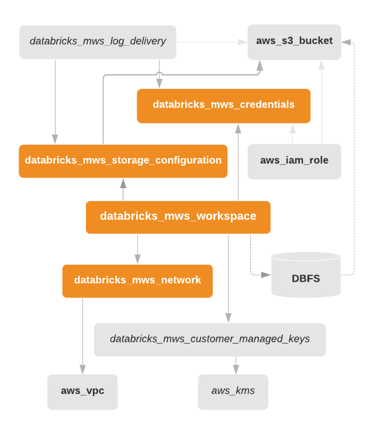

Databricks E2 workspace with BYOVPC

Creates AWS IAM cross-account role, AWS S3 root bucket, VPC with Internet gateway, NAT, routing, one public subnet,  
two private subnets in two different regions. Then it ties all together and creates an E2 workspace.

## Inputs

| Name | Description | Type | Default | Required |
|------|-------------|------|---------|:--------:|
| cidr\_block | n/a | `string` | `"10.4.0.0/16"` | no |
| databricks\_account\_id | n/a | `any` | n/a | yes |
| databricks\_account\_password | n/a | `any` | n/a | yes |
| databricks\_account\_username | n/a | `any` | n/a | yes |
| region | n/a | `string` | `"eu-west-1"` | no |
| tags | n/a | `map` | `{}` | no |

## Outputs

| Name | Description |
|------|-------------|
| databricks\_host | n/a |

